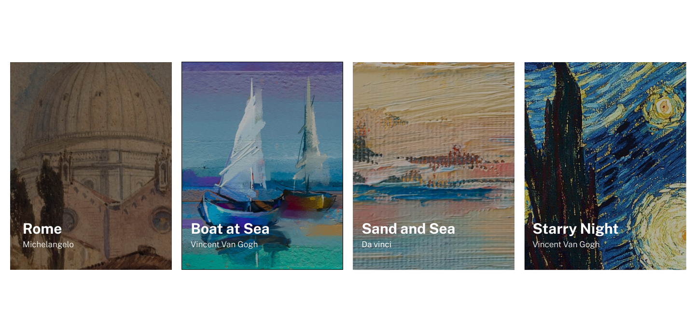
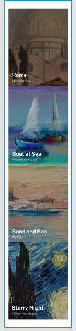

# Lista de imagens com Flexbox
Uma lista de imagens de pinturas famosas, com seus respectivos nomes e autores logo abaixo.

## Tecnologias utilizadas 
- HTML;
- CSS.

## Layout esperado Desktop:
Layout com as imagens uma ao lado da outra, no formato de desktop.

## Layout esperado Mobile:
Layout com as imagens uma abaixo da outra, com um pequeno gap de 1px. Formato mobile.

## Serviços usados 
- VSCode;
- GitHub;
- GitHub Pages.

## Funcionalidades
Exibição de pinturas de artistas famosos.

## Links
- GitPages:
- Link do repositório: 

## Autor
Ricardo Vitor Castilho.